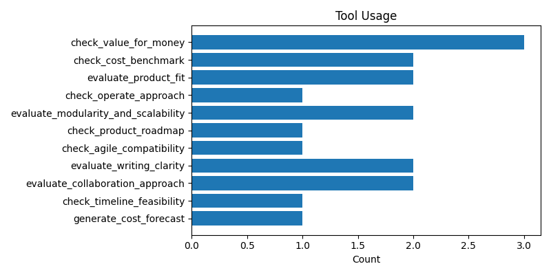
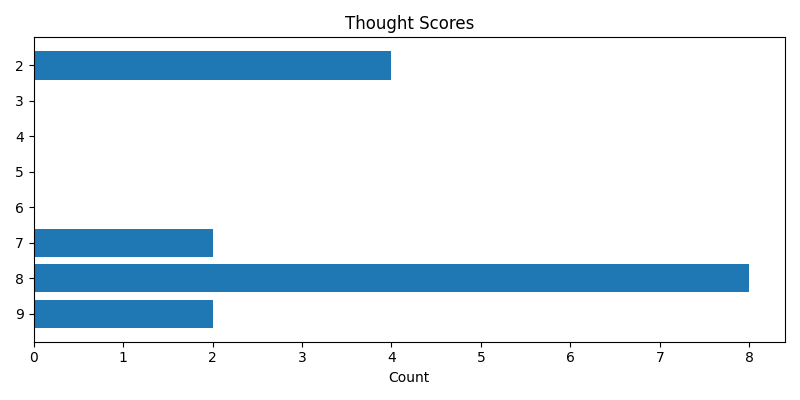

# 📊 Evaluation Summary Report – `2025-04-02_22-38-47`

## üîß Tool Usage
- check_value_for_money: 3 time(s)
- check_cost_benchmark: 2 time(s)
- evaluate_product_fit: 2 time(s)
- check_operate_approach: 1 time(s)
- evaluate_modularity_and_scalability: 2 time(s)
- check_product_roadmap: 1 time(s)
- check_agile_compatibility: 1 time(s)
- evaluate_writing_clarity: 2 time(s)
- evaluate_collaboration_approach: 2 time(s)
- check_timeline_feasibility: 1 time(s)
- generate_cost_forecast: 1 time(s)


## üí≠ Thought Score Distribution
- Score 9: 2 thought(s)
- Score 8: 8 thought(s)
- Score 7: 2 thought(s)
- Score 2: 4 thought(s)


## ⚠️ Log Health
- ‚úÖ No errors or warnings found in the log.

## ‚ùó Tool Failures

---

## ‚úÖ Tool Success Rates
- check_value_for_money: 3/3 successful (100.0%)
- check_cost_benchmark: 2/2 successful (100.0%)
- evaluate_product_fit: 2/2 successful (100.0%)
- check_operate_approach: 1/1 successful (100.0%)
- evaluate_modularity_and_scalability: 2/2 successful (100.0%)
- check_product_roadmap: 1/1 successful (100.0%)
- check_agile_compatibility: 1/1 successful (100.0%)
- evaluate_writing_clarity: 2/2 successful (100.0%)
- evaluate_collaboration_approach: 2/2 successful (100.0%)
- check_timeline_feasibility: 1/1 successful (100.0%)
- generate_cost_forecast: 1/1 successful (100.0%)

---

## 🧠 Thoughts Generated
## 🧠 Thought Quality & Redundancy
- Total thoughts generated: 8
- Unique semantic clusters: 5
- Thoughts reused in tools: 4/8 (50%)

**Cluster Samples:**

üîπ Cluster 1:
  - No valid thoughts generated.
  - No valid thoughts generated.
  - No valid thoughts generated.

üîπ Cluster 2:
  - The proposal mentions premium features that may contribute to higher pricing, but it's unclear if these features align with the client's criteria of cost-effectiveness and trust.

üîπ Cluster 3:
  - The proposal mentions that the pricing is slightly higher due to premium features, which may impact the cost-effectiveness aspect of the evaluation criteria.

üîπ Cluster 4:
  - The proposal mentions that the product solves the stated problem, is easy to install and use, and has competitive pricing, which are key factors for the client.

üîπ Cluster 5:
  - The proposal mentions that pricing is competitive, but it lacks specific details on cost-effectiveness.

---

## 💠 Thought Deduplication Summary
- Total Thoughts Generated: 32
- Unique Thoughts Retained: 16
- Redundant Thoughts Filtered: 16

### 🔁 Sample Redundant Thoughts Filtered
- What are the specific needs and requirements outlined in the RFP related to technology solutions?
- How do the features and capabilities of the proposed system address these specific needs and requirements effectively?
- Are the premium features offered by the vendor necessary to meet the outlined needs, or do they add unnecessary complexity and cost to the solution?
- The evaluation of cost-effectiveness and trust should also consider the specific premium features offered by the vendor in relation to the client's needs and expectations.
- What specific premium features are included in the pricing that justify the slightly higher cost? Are these features essential for the organization's needs, or are they more of a luxury add-on?
- Are there any hidden costs or additional fees that are not explicitly mentioned in the proposal? It's important to have a clear understanding of the full cost implications beyond the initial pricing
- How does the level of 24/7 support provided by this vendor compare to competitors offering similar services? Is the higher cost justified by superior support services that could potentially save costs in the long run through quicker issue resolution and minimized downtime?
- The proposal emphasizes premium features and 24/7 support, which may justify the slightly higher pricing. It is essential to assess if these features align with the client's needs and offer sufficient value to justify the cost.
- How does the proposed solution specifically address the unique requirements and challenges outlined in the RFP?
- What level of customization or configuration is possible with the solution to ensure it aligns with the organization's specific needs?
- Are there any potential limitations or gaps in the proposed solution that could impact its effectiveness in the organization's environment?
- The vendor's product seems to align well with the client's requirements in terms of solution fit, including problem-solving capabilities, ease of installation and use, and competitive pricing.
- What specific pricing details are provided in the proposal, such as initial costs, licensing fees, maintenance fees, and any potential scalability costs?
- Are there any optional add-ons or customization services mentioned that could incur extra charges beyond the base price?
- How does the proposed pricing compare to competitors in the market, and is there a breakdown of the value proposition offered at the stated cost?
- The proposal claims that the product is cost-effective, but it lacks concrete evidence to support this claim.

---

## 🧠 Embedding Cache Usage
- Hits: 0
- Misses: 8
- Total Requests: 8
- Cache Hit Rate: **0.0%**

---


## 🧠 Reasoning Chain Analysis
## üîç Criterion Reasoning Trace


---

### 🧠 Criterion: Solution Fit
**Final Score:** 7
**Explanation:** The proposal addresses the solution fit criterion by mentioning that they provide an intuitive, reliable system with 24/7 support. The mention of premium features that contribute to slightly higher pricing suggests that the solution may offer added value. However, more specific details about how these premium features align with the client's criteria and needs would further enhance the evaluation.

#### 🧠 Tree of Thought
- ‚úÖ Score 2: *No valid thoughts generated.*

#### 🤖 ReAct Steps
1. üí≠ *The proposal mentions premium features that may contribute to higher pricing, but it's unclear if these features align with the client's criteria of cost-effectiveness and trust.*
   ⚙️ `check_value_for_money["The pricing is slightly higher due to premium features."]`
   👁️ *Observation:* In evaluating the cost described in the proposal, it is important to consider the value of the services and features provided in relation to the price being charged. While the pricing is described as slightly higher due to premium features, it is essential to assess whether the additional cost is justified by the quality and scope of the offering.

In general, pricing that is slightly higher due to premium features can be considered appropriate if the features provided are unique, valuable, and enhance the overall user experience. Premium features typically imply added functionality, improved performance, enhanced security, or exclusive access to certain services. If the premium features offered in this proposal align with the needs and preferences of the target audience and provide significant benefits, then the slightly higher pricing may indeed be justified.

It is also important to consider the reputation and track record of the vendor in delivering high-quality products and services. If the vendor has a history of providing reliable systems and excellent customer support, then customers may be willing to pay a premium for the assurance of receiving top-notch service.

Overall, the appropriateness of the price for the scope and quality of the offering depends on the specific details of the premium features included, the perceived value they provide to customers, and the reputation of the vendor. By carefully evaluating these factors, one can determine whether the cost described in the proposal offers good value for the services and features provided.
   ‚úÖ Used in score | ‚úÖ Success

#### üß∞ Missing Tools by Section

##### üîπ Cost
- check_cost_benchmark: Score 0.790

##### üîπ Solution Fit
- evaluate_product_fit: Score 0.786
- evaluate_modularity_and_scalability: Score 0.763
- check_product_roadmap: Score 0.755

##### üîπ Methodology
- check_operate_approach: Score 0.773
- check_agile_compatibility: Score 0.753
- evaluate_collaboration_approach: Score 0.751

##### üîπ General
- suggest_tool_for: Score 0.754
- evaluate_writing_clarity: Score 0.752

##### üîπ Implementation Plan
- check_timeline_feasibility: Score 0.750

#### 🤖 Auto-Run Tools
- `check_cost_benchmark` for *Solution Fit* (Score: 0.790)
  > Based on the information provided in the vendor response, it appears that the slightly higher pricing is justified due to the inclusion of premium features and 24/7 support. While the cost may be slig...
- `evaluate_product_fit` for *Solution Fit* (Score: 0.786)
  > Based on the information provided, it seems that the vendor response aligns well with the client's requirements. The client is looking for an intuitive and reliable system with 24/7 support, which the...
- `check_operate_approach` for *Solution Fit* (Score: 0.773)
  > Based on the vendor's response, it is clear that they do provide 24/7 support as part of their Operate phase. However, the response does not specifically mention other key components such as support m...
- `evaluate_modularity_and_scalability` for *Solution Fit* (Score: 0.763)
  > Based on the information provided in the section, it is not clear how modular and scalable the solution is. The vendor response mentions providing an intuitive and reliable system with 24/7 support, b...
- `check_product_roadmap` for *Solution Fit* (Score: 0.755)
  > Based on the provided section of the proposal, it does not appear that a product roadmap or future direction and investment strategy are explicitly mentioned. The focus seems to be on the current feat...
- `check_agile_compatibility` for *Solution Fit* (Score: 0.753)
  > Based on the provided response, it is difficult to evaluate the vendor's use of Agile in their delivery methodology. The response does not mention any specific details about their approach to project ...
- `evaluate_writing_clarity` for *Solution Fit* (Score: 0.752)
  > The writing in this section is clear and concise. The meaning is obvious, and there are no ambiguous phrases. The section is easy to read and straightforward in conveying the vendor's key points. Over...
- `evaluate_collaboration_approach` for *Solution Fit* (Score: 0.751)
  > Based on the provided section, the evaluation indicates a lack of focus on team or collaboration aspects with the client. The vendor response solely focuses on the features and pricing of their system...
- `check_timeline_feasibility` for *Solution Fit* (Score: 0.750)
  > Based on the provided text, there is no mention of a project implementation timeline. Therefore, it is not possible to assess whether the timeline is realistic for a complex IT implementation. The tex...

⚠️ Could not render reasoning graph: [Errno 2] No such file or directory: 'plots/lineage_Solution_Fit.png'

---

### 🧠 Criterion: Cost
**Final Score:** 8
**Explanation:** The proposal acknowledges that the pricing is slightly higher due to premium features, which shows transparency and provides a justification for the cost. It also mentions the 24/7 support, which adds value to the overall cost-effectiveness of the offering. However, more specific details on the pricing model and potential cost escalation factors could further enhance the evaluation of the cost criterion.

#### 🧠 Tree of Thought
- ‚úÖ Score 2: *No valid thoughts generated.*

#### 🤖 ReAct Steps
1. üí≠ *The proposal mentions that the pricing is slightly higher due to premium features, which may impact the cost-effectiveness aspect of the evaluation criteria.*
   ⚙️ `check_value_for_money["The pricing is slightly higher due to premium features."]`
   👁️ *Observation:* Based on best practices, it is important to consider the value proposition offered by the vendor in relation to the pricing. In this case, the vendor mentions that they provide premium features along with their services, which could justify a slightly higher cost. 

When evaluating the price, it is important to consider the quality and scope of the offering. If the premium features provided by the vendor offer significant benefits or added value compared to competitors, then the slightly higher pricing may be justified. 

Additionally, the fact that the vendor offers 24/7 support can also contribute to the overall value of the service. Customers often place a high value on reliable support, especially for critical systems or services.

Overall, as long as the premium features and 24/7 support provided by the vendor align with the needs and expectations of the customer, the slightly higher pricing may be considered appropriate for the scope and quality of the offering. It is important for customers to carefully evaluate the features and benefits provided by the vendor to determine if the price aligns with the value they expect to receive.
   ‚úÖ Used in score | ‚úÖ Success

#### üß∞ Missing Tools by Section

##### üîπ Cost
- check_cost_benchmark: Score 0.800
- generate_cost_forecast: Score 0.754

##### üîπ Methodology
- check_operate_approach: Score 0.757

##### üîπ Solution Fit
- evaluate_product_fit: Score 0.752

#### 🤖 Auto-Run Tools
- `generate_cost_forecast` for *Cost* (Score: 0.754)
  > Based on the information provided in the context, it is mentioned that the vendor's pricing is slightly higher due to premium features. This suggests that the total cost over the full term of the agre...

⚠️ Could not render reasoning graph: [Errno 2] No such file or directory: 'plots/lineage_Cost.png'

---

### 🧠 Criterion: Solution Fit
**Final Score:** 8
**Explanation:** The proposal directly addresses the solution fit criterion by stating that the product solves the stated problem, is easy to install and use, and has competitive pricing. These key factors align well with the client's requirements, demonstrating a strong match with the solution fit criterion. However, more detailed information on how the product solves the stated problem and why the pricing is competitive could further enhance the proposal's effectiveness in addressing this criterion.

#### 🧠 Tree of Thought
- ‚úÖ Score 2: *No valid thoughts generated.*

#### 🤖 ReAct Steps
1. üí≠ *The proposal mentions that the product solves the stated problem, is easy to install and use, and has competitive pricing, which are key factors for the client.*
   ⚙️ `evaluate_product_fit["Our product solves the stated problem. It is easy to install and use. Pricing is competitive."]`
   👁️ *Observation:* Based on the vendor response provided, it seems that the product functionality described aligns well with the client's requirements. The vendor explicitly states that their product solves the stated problem, is easy to install and use, and has competitive pricing. 

By addressing the client's problem directly, the product functionality aligns with the key need of solving the issue at hand. The ease of installation and use also meets the client's requirement for a user-friendly solution. Additionally, competitive pricing aligns with the client's need for a cost-effective option.

Overall, the vendor response demonstrates a strong match with the client's requirements by addressing key needs effectively.
   ‚úÖ Used in score | ‚úÖ Success

#### üß∞ Missing Tools by Section

##### üîπ Cost
- check_value_for_money: Score 0.772
- check_cost_benchmark: Score 0.768

##### üîπ General
- suggest_tool_for: Score 0.763
- evaluate_writing_clarity: Score 0.757

##### üîπ Solution Fit
- evaluate_modularity_and_scalability: Score 0.759

##### üîπ Methodology
- evaluate_collaboration_approach: Score 0.751

#### 🤖 Auto-Run Tools
- `check_value_for_money` for *Solution Fit* (Score: 0.772)
  > Based on the limited information provided in the context, it is difficult to fully evaluate the value of the cost for the services and features offered. However, the fact that the vendor highlights th...
- `check_cost_benchmark` for *Solution Fit* (Score: 0.768)
  > Without specific details on the proposed cost or the product being offered, it is difficult to determine whether the pricing is within a reasonable range compared to similar offerings in the market. H...
- `evaluate_modularity_and_scalability` for *Solution Fit* (Score: 0.759)
  > Based on the provided context, there is no specific information provided about the modularity and scalability of the solution. The focus is on the product solving the stated problem, being easy to ins...
- `evaluate_writing_clarity` for *Solution Fit* (Score: 0.757)
  > The section provided is clear and concise, presenting the key points of the vendor's response in a straightforward manner. However, it lacks depth and detail, which could leave the reader wanting more...
- `evaluate_collaboration_approach` for *Solution Fit* (Score: 0.751)
  > Based on the provided section and context, there is a lack of information regarding team or collaboration approach with the client. The section focuses solely on the product's features and pricing, wi...

⚠️ Could not render reasoning graph: [Errno 2] No such file or directory: 'plots/lineage_Solution_Fit.png'

---

### 🧠 Criterion: Cost
**Final Score:** 5
**Explanation:** The proposal mentions that pricing is competitive, but it lacks specific details on cost-effectiveness. Without more information on the value provided compared to the cost, it is difficult to fully evaluate the cost aspect of the proposal.

#### 🧠 Tree of Thought
- ‚úÖ Score 2: *No valid thoughts generated.*

#### 🤖 ReAct Steps
1. üí≠ *The proposal mentions that pricing is competitive, but it lacks specific details on cost-effectiveness.*
   ⚙️ `check_value_for_money["The pricing is competitive, but what specific value does it offer compared to the cost?"]`
   👁️ *Observation:* ⚠️ Tool 'check_value_for_money' already executed for this proposal. Skipping duplicate call.
   ‚úÖ Used in score | ‚ùå Failed

#### üß∞ Missing Tools by Section

##### üîπ Cost
- check_cost_benchmark: Score 0.785

⚠️ Could not render reasoning graph: [Errno 2] No such file or directory: 'plots/lineage_Cost.png'

---


## 🧠 Reasoning Lineage Table (All Criteria)

## 🧠 Reasoning Lineage Table


### üîπ Solution Fit

| Step | Thought | Source | Action | Observation | Used in Score | Tool Success |
|------|---------|--------|--------|-------------|----------------|---------------|
| ToT-1 | No valid thoughts generated. | ToT | — | — | ✅ | — |
| Step 1 | The proposal mentions premium features that may contribute to higher pricing, but it's unclear if these features align with the client's criteria of cost-effectiveness and trust. | ReAct | `check_value_for_money["The pricing is slightly higher due to premium features."]` | In evaluating the cost described in the ... | ‚úÖ | ‚úÖ |

### üîπ Cost

| Step | Thought | Source | Action | Observation | Used in Score | Tool Success |
|------|---------|--------|--------|-------------|----------------|---------------|
| ToT-1 | No valid thoughts generated. | ToT | — | — | ✅ | — |
| Step 1 | The proposal mentions that the pricing is slightly higher due to premium features, which may impact the cost-effectiveness aspect of the evaluation criteria. | ReAct | `check_value_for_money["The pricing is slightly higher due to premium features."]` | Based on best practices, it is important... | ‚úÖ | ‚úÖ |

### üîπ Solution Fit

| Step | Thought | Source | Action | Observation | Used in Score | Tool Success |
|------|---------|--------|--------|-------------|----------------|---------------|
| ToT-1 | No valid thoughts generated. | ToT | — | — | ✅ | — |
| Step 1 | The proposal mentions that the product solves the stated problem, is easy to install and use, and has competitive pricing, which are key factors for the client. | ReAct | `evaluate_product_fit["Our product solves the stated problem. It is easy to install and use. Pricing is competitive."]` | Based on the vendor response provided, i... | ‚úÖ | ‚úÖ |

### üîπ Cost

| Step | Thought | Source | Action | Observation | Used in Score | Tool Success |
|------|---------|--------|--------|-------------|----------------|---------------|
| ToT-1 | No valid thoughts generated. | ToT | — | — | ✅ | — |
| Step 1 | The proposal mentions that pricing is competitive, but it lacks specific details on cost-effectiveness. | ReAct | `check_value_for_money["The pricing is competitive, but what specific value does it offer compared to the cost?"]` | ⚠️ Tool 'check_value_for_money' already ... | ✅ | ❌ |

---

## 🔄 OpenAI API Calls
- Total Calls: 105
- Average Time: 0.97 sec

---

- OpenAI Call Sources & Token Usage
- **generate_thoughts_openai**: 8 call(s), 930 prompt tokens, 645 completion tokens (total 1575)
- **<listcomp>**: 16 call(s), 0 prompt tokens, 0 completion tokens (total 0)
- **score_thoughts_with_openai_batch**: 4 call(s), 986 prompt tokens, 72 completion tokens (total 1058)
- **score_thought_with_openai**: 16 call(s), 2882 prompt tokens, 32 completion tokens (total 2914)
- **get_cached_embedding**: 16 call(s), 0 prompt tokens, 0 completion tokens (total 0)
- **suggest_tools_by_embedding**: 8 call(s), 0 prompt tokens, 0 completion tokens (total 0)
- **run_react_loop_for_rfp_eval**: 8 call(s), 27160 prompt tokens, 429 completion tokens (total 27589)
- **check_value_for_money**: 3 call(s), 400 prompt tokens, 687 completion tokens (total 1087)
- **get_relevant_tools**: 4 call(s), 0 prompt tokens, 0 completion tokens (total 0)
- **check_cost_benchmark**: 2 call(s), 270 prompt tokens, 351 completion tokens (total 621)
- **evaluate_product_fit**: 2 call(s), 253 prompt tokens, 255 completion tokens (total 508)
- **check_operate_approach**: 1 call(s), 122 prompt tokens, 214 completion tokens (total 336)
- **evaluate_modularity_and_scalability**: 2 call(s), 234 prompt tokens, 279 completion tokens (total 513)
- **check_product_roadmap**: 1 call(s), 117 prompt tokens, 184 completion tokens (total 301)
- **check_agile_compatibility**: 1 call(s), 140 prompt tokens, 144 completion tokens (total 284)
- **evaluate_writing_clarity**: 2 call(s), 326 prompt tokens, 145 completion tokens (total 471)
- **evaluate_collaboration_approach**: 2 call(s), 296 prompt tokens, 178 completion tokens (total 474)
- **check_timeline_feasibility**: 1 call(s), 110 prompt tokens, 112 completion tokens (total 222)
- **score_proposal_content_with_llm_and_tools**: 4 call(s), 3429 prompt tokens, 297 completion tokens (total 3726)
- **generate_cost_forecast**: 1 call(s), 148 prompt tokens, 214 completion tokens (total 362)
- **evaluate_proposal**: 2 call(s), 393 prompt tokens, 368 completion tokens (total 761)
- **generate_final_comparison_summary**: 1 call(s), 992 prompt tokens, 407 completion tokens (total 1399)

---


## üí∏ Token Usage Summary
- Prompt Tokens: 39188
- Completion Tokens: 5013
- Total Tokens: 44201
- Estimated Cost (gpt-3.5-turbo): **$0.0688 USD**

---


## üí∏ Prompt + Response Preview
## üìã Sample OpenAI Calls (first 20)
### üîπ Call #1
- **Source:** generate_thoughts_openai
- **Prompt tokens:** 111
- **Completion tokens:** 87
**Prompt Preview:**
```
You are an expert evaluator of RFP proposals.      You are evaluating a technology vendor proposal for the criterion: **Solution Fit**.      Proposal excerpt:     """     We provide an intuitive, reliable system with 24/7 support. Our pricing is slightly higher due to premium features.     """      Current reasoning path: (start)      What are the next 3 useful thoughts or questions that could help you assess the proposal based on this criterion?     Respond with a numbered list....
```
**Response Preview:**
```
1. How well does the proposed system align with the specific needs and requirements outlined in the RFP? 2. What are the key features and functionalities offered by the vendor, and how do they address the challenges or goals identified in the RFP? 3. Are the premium features mentioned in the proposal essential for meeting the organization's objectives, or are they more of a luxury add-on that may not significantly impact the solution fit?...
```

### üîπ Call #2
- **Source:** <listcomp>
- **Prompt tokens:** 0
- **Completion tokens:** 0
**Prompt Preview:**
```
How well does the proposed system align with the specific needs and requirements outlined in the RFP?...
```
**Response Preview:**
```
[Embedding vector of length 1536]...
```

### üîπ Call #3
- **Source:** <listcomp>
- **Prompt tokens:** 0
- **Completion tokens:** 0
**Prompt Preview:**
```
What are the key features and functionalities offered by the vendor, and how do they address the challenges or goals identified in the RFP?...
```
**Response Preview:**
```
[Embedding vector of length 1536]...
```

### üîπ Call #4
- **Source:** <listcomp>
- **Prompt tokens:** 0
- **Completion tokens:** 0
**Prompt Preview:**
```
Are the premium features mentioned in the proposal essential for meeting the organization's objectives, or are they more of a luxury add-on that may not significantly impact the solution fit?...
```
**Response Preview:**
```
[Embedding vector of length 1536]...
```

### üîπ Call #5
- **Source:** score_thoughts_with_openai_batch
- **Prompt tokens:** 262
- **Completion tokens:** 15
**Prompt Preview:**
```
You are scoring reasoning questions to evaluate a proposal.  Criterion: Solution Fit  Proposal Excerpt: We provide an intuitive, reliable system with 24/7 support. Our pricing is slightly higher due to premium features.  Rate each of the following thoughts from 0 to 10 based on how helpful they are in evaluating the proposal for this criterion.  Use this rubric to assign a score from 1 to 10:      - 9–10: Insightful, highly relevant, and clearly advances evaluation.     - 7–8: Solid, useful thou...
```
**Response Preview:**
```
1. 9 2. 8 3. 7...
```

### üîπ Call #6
- **Source:** score_thought_with_openai
- **Prompt tokens:** 184
- **Completion tokens:** 2
**Prompt Preview:**
```
You are evaluating a thought generated by an AI agent for assessing a technology proposal.      Use this rubric to assign a score from 1 to 10:      - 9–10: Insightful, highly relevant, and clearly advances evaluation.     - 7–8: Solid, useful thought, but not exceptionally insightful.     - 4–6: Somewhat helpful, but vague or redundant.     - 1–3: Not useful, unclear, or irrelevant.      Proposal:     """     We provide an intuitive, reliable system with 24/7 support. Our pricing is slightly hi...
```
**Response Preview:**
```
8...
```

### üîπ Call #7
- **Source:** score_thought_with_openai
- **Prompt tokens:** 192
- **Completion tokens:** 2
**Prompt Preview:**
```
You are evaluating a thought generated by an AI agent for assessing a technology proposal.      Use this rubric to assign a score from 1 to 10:      - 9–10: Insightful, highly relevant, and clearly advances evaluation.     - 7–8: Solid, useful thought, but not exceptionally insightful.     - 4–6: Somewhat helpful, but vague or redundant.     - 1–3: Not useful, unclear, or irrelevant.      Proposal:     """     We provide an intuitive, reliable system with 24/7 support. Our pricing is slightly hi...
```
**Response Preview:**
```
8...
```

### üîπ Call #8
- **Source:** score_thought_with_openai
- **Prompt tokens:** 199
- **Completion tokens:** 2
**Prompt Preview:**
```
You are evaluating a thought generated by an AI agent for assessing a technology proposal.      Use this rubric to assign a score from 1 to 10:      - 9–10: Insightful, highly relevant, and clearly advances evaluation.     - 7–8: Solid, useful thought, but not exceptionally insightful.     - 4–6: Somewhat helpful, but vague or redundant.     - 1–3: Not useful, unclear, or irrelevant.      Proposal:     """     We provide an intuitive, reliable system with 24/7 support. Our pricing is slightly hi...
```
**Response Preview:**
```
8...
```

### üîπ Call #9
- **Source:** generate_thoughts_openai
- **Prompt tokens:** 127
- **Completion tokens:** 70
**Prompt Preview:**
```
You are an expert evaluator of RFP proposals.      You are evaluating a technology vendor proposal for the criterion: **Solution Fit**.      Proposal excerpt:     """     We provide an intuitive, reliable system with 24/7 support. Our pricing is slightly higher due to premium features.     """      Current reasoning path: How well does the proposed system align with the specific needs and requirements outlined in the RFP?      What are the next 3 useful thoughts or questions that could help you ...
```
**Response Preview:**
```
1. What are the specific needs and requirements outlined in the RFP related to technology solutions?  2. How do the features and capabilities of the proposed system address these specific needs and requirements effectively? 3. Are the premium features offered by the vendor necessary to meet the outlined needs, or do they add unnecessary complexity and cost to the solution?...
```

### üîπ Call #10
- **Source:** get_cached_embedding
- **Prompt tokens:** 0
- **Completion tokens:** 0
**Prompt Preview:**
```
What are the specific needs and requirements outlined in the RFP related to technology solutions?...
```
**Response Preview:**
```
[Embedding vector of length 1536]...
```

### üîπ Call #11
- **Source:** get_cached_embedding
- **Prompt tokens:** 0
- **Completion tokens:** 0
**Prompt Preview:**
```
How do the features and capabilities of the proposed system address these specific needs and requirements effectively?...
```
**Response Preview:**
```
[Embedding vector of length 1536]...
```

### üîπ Call #12
- **Source:** get_cached_embedding
- **Prompt tokens:** 0
- **Completion tokens:** 0
**Prompt Preview:**
```
Are the premium features offered by the vendor necessary to meet the outlined needs, or do they add unnecessary complexity and cost to the solution?...
```
**Response Preview:**
```
[Embedding vector of length 1536]...
```

### üîπ Call #13
- **Source:** suggest_tools_by_embedding
- **Prompt tokens:** 0
- **Completion tokens:** 0
**Prompt Preview:**
```
Criterion: Solution Fit  Top Thoughts: No valid thoughts generated....
```
**Response Preview:**
```
[Embedding vector of length 1536]...
```

### üîπ Call #14
- **Source:** run_react_loop_for_rfp_eval
- **Prompt tokens:** 3295
- **Completion tokens:** 52
**Prompt Preview:**
```
You are a technology advisor evaluating a vendor proposal against the following RFP criterion: **Solution Fit**  The client cares about cost-effectiveness, performance, security, trust, and ease of implementation.  Based on the proposal content below, begin your evaluation with a short thought and then choose an action. Use the tool that best supports your analysis.  💡 Thoughts to consider: No valid thoughts generated.  🛠️ Format your response like this: Thought: <your thought> Action: <one of t...
```
**Response Preview:**
```
Thought: The proposal mentions premium features that may contribute to higher pricing, but it's unclear if these features align with the client's criteria of cost-effectiveness and trust.  Action: check_value_for_money["The pricing is slightly higher due to premium features."]...
```

### üîπ Call #15
- **Source:** <listcomp>
- **Prompt tokens:** 0
- **Completion tokens:** 0
**Prompt Preview:**
```
The proposal mentions premium features that may contribute to higher pricing, but it's unclear if these features align with the client's criteria of cost-effectiveness and trust....
```
**Response Preview:**
```
[Embedding vector of length 1536]...
```

### üîπ Call #16
- **Source:** check_value_for_money
- **Prompt tokens:** 138
- **Completion tokens:** 273
**Prompt Preview:**
```
Evaluate whether the cost described appears to offer good value for the services and features provided. Is the price appropriate for the scope and quality of the offering?  Explain your reasoning based on best practices and common expectations for similar proposals.  Query: The pricing is slightly higher due to premium features.  ------------------   --- Section (Vendor Response) --- We provide an intuitive, reliable system with 24/7 support. Our pricing is slightly higher due to premium feature...
```
**Response Preview:**
```
In evaluating the cost described in the proposal, it is important to consider the value of the services and features provided in relation to the price being charged. While the pricing is described as slightly higher due to premium features, it is essential to assess whether the additional cost is justified by the quality and scope of the offering.  In general, pricing that is slightly higher due to premium features can be considered appropriate if the features provided are unique, valuable, and ...
```

### üîπ Call #17
- **Source:** suggest_tools_by_embedding
- **Prompt tokens:** 0
- **Completion tokens:** 0
**Prompt Preview:**
```
Criterion: Solution Fit  Top Thoughts: No valid thoughts generated....
```
**Response Preview:**
```
[Embedding vector of length 1536]...
```

### üîπ Call #18
- **Source:** run_react_loop_for_rfp_eval
- **Prompt tokens:** 3621
- **Completion tokens:** 57
**Prompt Preview:**
```
You are a technology advisor evaluating a vendor proposal against the following RFP criterion: **Solution Fit**  The client cares about cost-effectiveness, performance, security, trust, and ease of implementation.  Based on the proposal content below, begin your evaluation with a short thought and then choose an action. Use the tool that best supports your analysis.  💡 Thoughts to consider: No valid thoughts generated.  🛠️ Format your response like this: Thought: <your thought> Action: <one of t...
```
**Response Preview:**
```
Thought: The evaluation of cost-effectiveness and trust should also consider the specific premium features offered by the vendor in relation to the client's needs and expectations. Action: check_product_roadmap["Roadmap includes support for AI triage, real-time collaboration, and national integration."]...
```

### üîπ Call #19
- **Source:** get_cached_embedding
- **Prompt tokens:** 0
- **Completion tokens:** 0
**Prompt Preview:**
```
The evaluation of cost-effectiveness and trust should also consider the specific premium features offered by the vendor in relation to the client's needs and expectations....
```
**Response Preview:**
```
[Embedding vector of length 1536]...
```

### üîπ Call #20
- **Source:** get_relevant_tools
- **Prompt tokens:** 0
- **Completion tokens:** 0
**Prompt Preview:**
```
Solution Fit: We provide an intuitive, reliable system with 24/7 support. Our pricing is slightly higher due to premium features....
```
**Response Preview:**
```
[Embedding vector of length 1536]...
```
